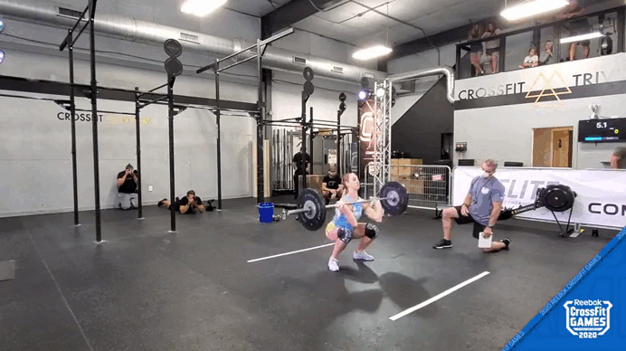
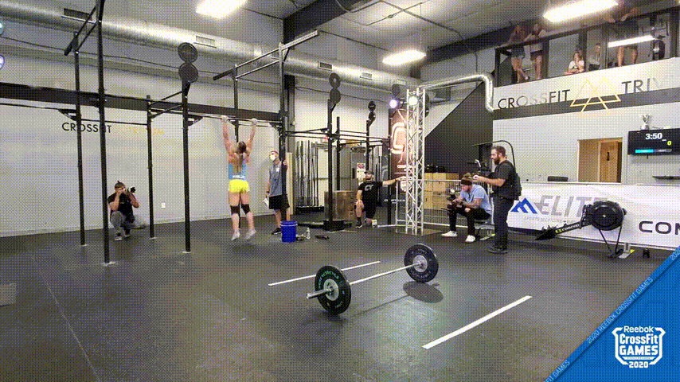
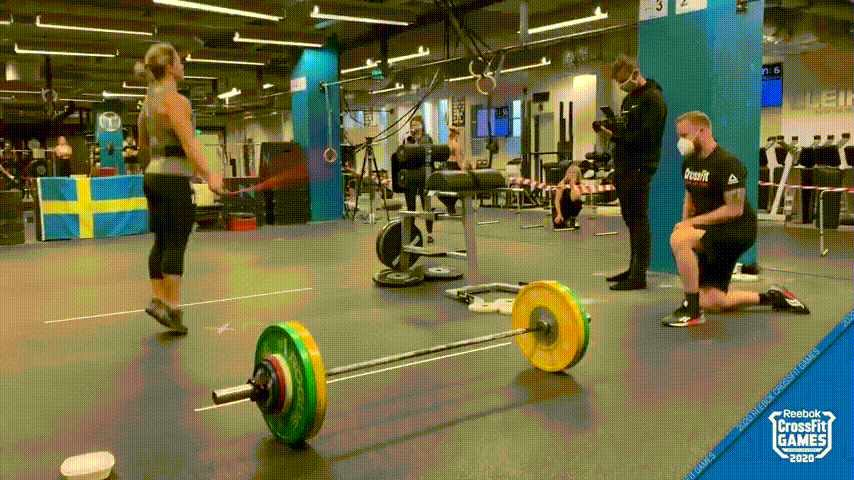
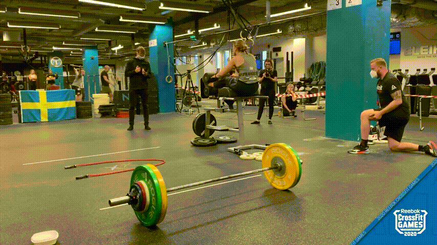
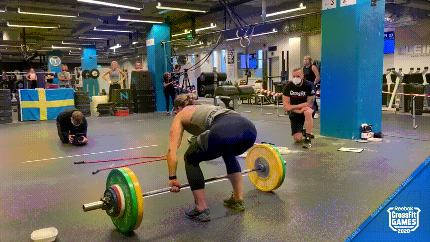
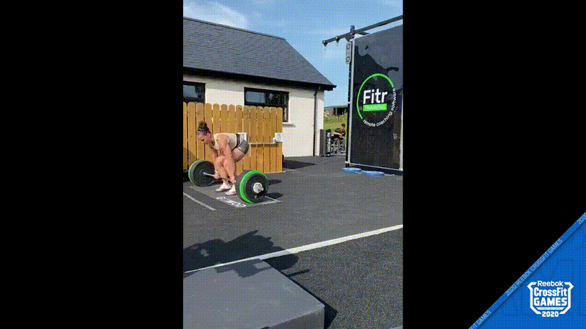
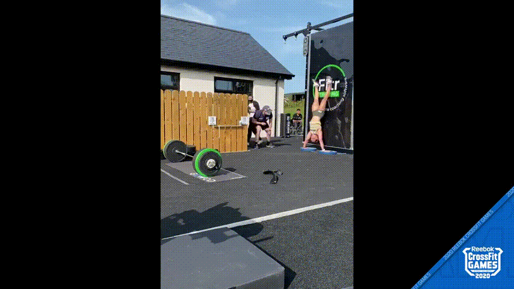
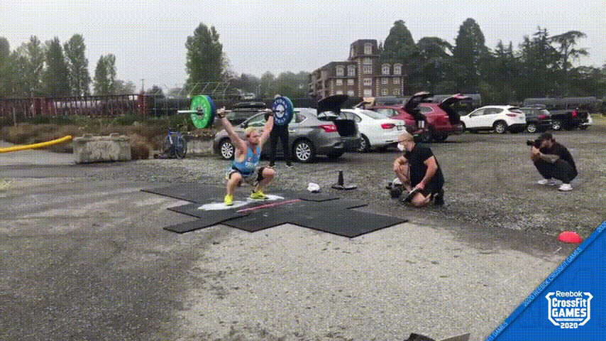

# tfm-misc

Several things used during CIDaeN's tfm.

## scripts

Python scripts to download youtube videos and generate clips with supervisely outputs.

## TFM_CIDaeN

LaTeX docs. Compile TFM.tex with LuaLaTeX.

## GIF of the movements

<table>
  <tr>
    <td>thruster</td>
      <td>
      </td>
    <td>chest-to-bar</td>
      <td>
      </td>
    <td>double-unders</td>
      <td>
      </td>
  </tr>
  <tr>
    <td>ghd</td>
      <td>
      </td>
    <td>power clean</td>
      <td>
      </td>
    <td>deadlift</td>
      <td>
      </td>
  </tr>
  <tr>
    <td>shspu</td>
      <td>
      </td>
    <td>ohs</td>
      <td>
      </td>
    <td>bar-facing burpee</td>
      <td>
      </td>
  </tr>
</table>
