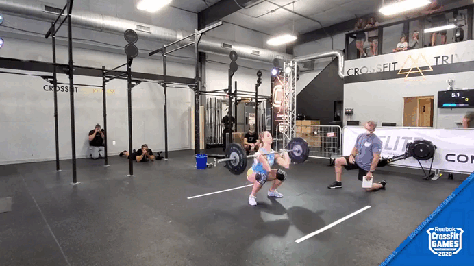

<!-- backgroundImage: "linear-gradient(135deg, #ffffff  0%, #aed6f1 100%)" -->

<!-- footer: 'Agustín Piqueres | Slides for CIDaEN's thesis | 2022' -->

<!-- 
_class: lead
_paginate: false
 -->

# Clasificación de movimientos de CrossFit: una aplicación con MoViNets <!-- fit -->

**Agustín Piqueres**

9/2022

---

<!-- footer: '' -->

<!-- 
_footer: '*https://arxiv.org/abs/1609.03499'
_paginate: true
 -->
# WaveNet*

Wavenet: A generative model for raw audio.
Aaron van den Oord, et al.
[@deepmind](https://deepmind.com/blog/article/wavenet-generative-model-raw-audio),  2016

## Contributions
- Generative model for wave-form forms
- Capable of capturing important audio structure at many time-scales
- Conditioning support

Led to the **most natural-sounding** speech/audio synthesis at the time.

---

### 1.1 Motivación

<!-- 
header : 'Clasificación de movimientos de CrossFit: una aplicación con MoViNets.'
-->

---

### 1.2 Objetivos

---

### 1.3 Estructura del proyecto

---

### 2.1 Deep Learning

---

### 2.2 Cloud

---

### 2.3 Trabajos relacionados

---

### 3.1 Extracción y Recolección de datos

#### 2.1.1 Introducción

---

### 3.1 Extracción y Recolección de datos
#### 3.1.2 Proceso de extracción

(Data extraction process)

---

### 3.1 Extracción y Recolección de datos

#### 3.1.3 Datos obtenidos

---

### 3.2 Experimentación con Deep Learning

#### 3.2.1 Introducción

---

### 3.2 Experimentación con Deep Learning

#### 3.2.2 Preprocesado de los datos

---

### 3.2 Experimentación con Deep Learning

#### 3.2.3 Experimentos realizados y resultados

- 80% training (2164 clips), 20% test (541)

- Más apuntes

* [*__Tensorboard.dev__*](https://tensorboard.dev/experiment/UXyupsnMQ2S74vdul3vdbw/#scalars)

---

<!-- https://github.com/marp-team/marp-core/issues/177 -->

### 3.2 Experimentación con Deep Learning

#### 3.2.4 Evaluación de los resultados

---

## 3. Desarrollo

### 3.3 Cloud y despliegue de la aplicación

#### 3.3.1 Introducción

---

## 3.3  Desarrollo 
### 3.3 Cloud y despliegue de la aplicación
#### 3.3.2 Arquitectura cloud

(Diagrama Cloud) 

---

## 3. Desarrollo

### 3.3 Cloud y despliegue de la aplicación

#### 3.3.3 Resultado y funcionamiento

---

<!-- REF: https://github.com/marp-team/marp-cli/issues/57 -->

<table>
  <tr>
    <td>thruster</td>
      <td>
      </td>
    <td>chest-to-bar</td>
      <td>
      </td>
    <td>double-unders</td>
      <td>
      </td>
  </tr>
  <tr>
    <td>ghd</td>
      <td>
      </td>
    <td>power clean</td>
      <td>
      </td>
    <td>deadlift</td>
      <td>
      </td>
  </tr>
  <tr>
    <td>shspu</td>
      <td>
      </td>
    <td>ohs</td>
      <td>
      </td>
    <td>bar-facing burpee</td>
      <td>
      </td>
  </tr>
</table>

---

## 4. Conclusiones

# Multi columns in Marp slide

## Column 1

Lorem ipsum dolor sit amet consectetur adipisicing elit. Voluptas eveniet, corporis commodi vitae accusamus obcaecati dolor corrupti eaque id numquam officia velit sapiente incidunt dolores provident laboriosam praesentium nobis culpa.

## Column 2

Tempore ad exercitationem necessitatibus nulla, optio distinctio illo non similique? Laborum dolor odio, ipsam incidunt corrupti quia nemo quo exercitationem adipisci quidem nesciunt deserunt repellendus inventore deleniti reprehenderit at earum.

---

# Tiling can improve the access pattern

## LHS Title
- item

---

Movimientoso
### bar-facing-burpee 

--- 

