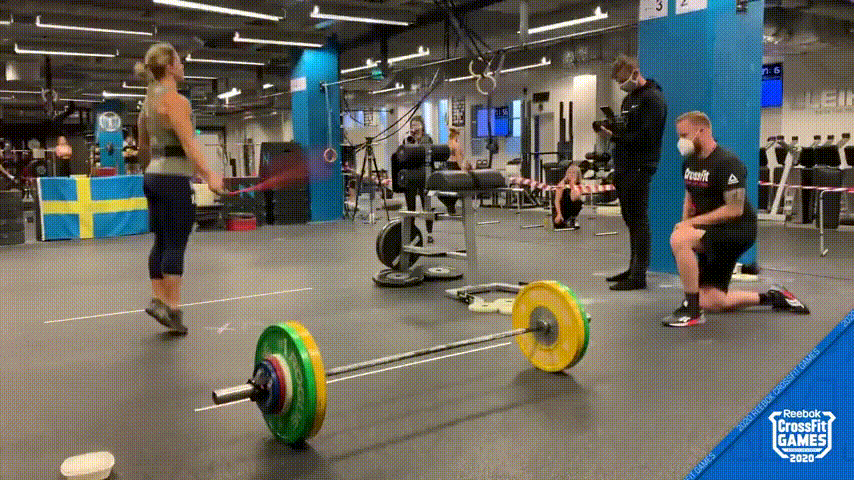
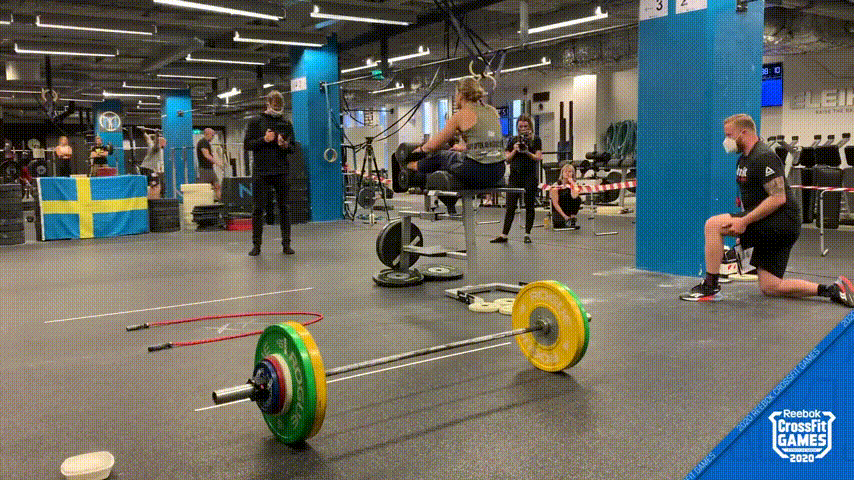
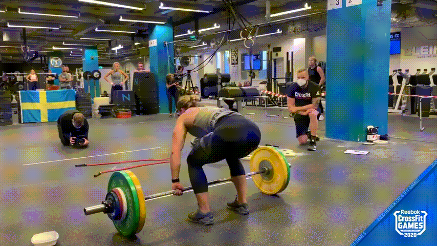
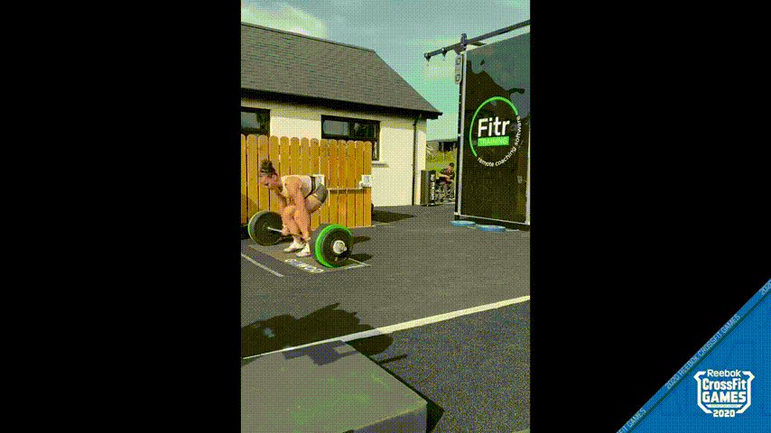
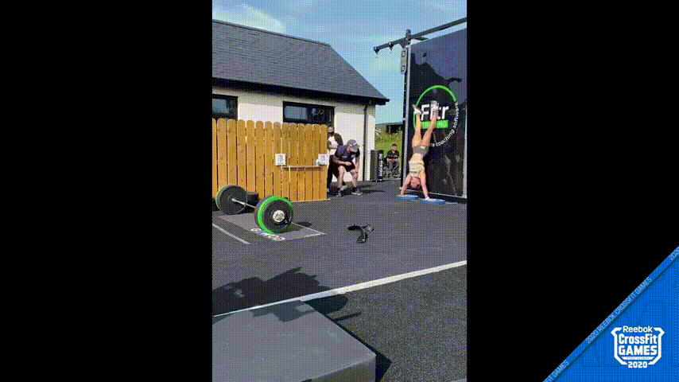

<!-- backgroundImage: "linear-gradient(135deg, #ffffff  0%, #aed6f1 100%)" -->

<!-- 
_class: lead
_paginate: false
 -->

# Clasificación de movimientos de CrossFit: una aplicación con MoViNets <!-- fit -->

**Agustín Piqueres** 

13/09/2022

<!-- footer: '' -->
<!-- _paginate: true -->

---

<!-- 
header : 'Clasificación de movimientos de CrossFit: una aplicación con MoViNets.'
-->

# 1.1 Motivación

Meter explicación de CrossFit (AQUÍ Y EN LA MEMORIA) y alguna imagen.

- Es un deporte con un gran número de participantes, y el número de competiciones sigue creciendo.

- Automatizando del proceso de corrección de videos:

  - Las personas pueden dejar una tarea repetitiva (se ahorra en personal).  

  - Se limitaría la inconsistencia entre distintos jueces en las correcciones.

---

# 1.2 Objetivos

Antes de llegar a ese punto, vamos a intentar crear una aplicación 
que sea capaz de clasificar movimientos de CrossFit,
para lo cuál será necesario:

- Crear un *Dataset* con movimientos de los distintos ejercicios. 

- Un modelo capaz de identificar correctamente los distintos movimientos.

- Una aplicación en la que un usuario sea capaz de subir un video 
y obtenga el movimiento del que se trata.

---

# 1.3 Estructura del proyecto

- **2 Estado del arte**

  - 2.1 Deep Learning
  - 2.2 Cloud
  - 2.3 Trabajos relacionados

- **3 Desarrollo**

  - 3.1 Extracción y recolección de datos
    - 3.1.1 Proceso de extracción
    - 3.1.2 Datos obtenidos

    
  - 3.2 Experimentación con Deep Learning
    - 3.2.1 Preprocesado de los datos
    - 3.2.2 Experimentos realizados y resultados
    - 3.2.3 Evaluación de resultados

  - 3.3 Cloud y despliegue de la aplicación
    - 3.3.1 Arquitectura cloud
    - 3.3.2 Resultado y funcionamiento

- **4 Conclusiones**

---

# 2.1 Deep Learning

El campo del [*Reconocimiento de Acciones*](https://paperswithcode.com/task/action-recognition-in-videos) (la tarea de identificar personas realizando acciones en imágenes o videos) ha crecido en los años. Las acciones humanas pueden reconocerse con diferentes metodologías (como *Optical Flow* o representaciones del esqueleto), pero este trabajo se centra en la [*Clasificación de Video*](https://paperswithcode.com/task/video-classification):

La tarea de producir una etiqueta relevante para un video dados sus *frames*.

#### Lista de Papers:

- Primeros datasets: [HMDB51](https://serre-lab.clps.brown.edu/resource/hmdb-a-large-human-motion-database/) o [UCF101](https://www.crcv.ucf.edu/data/UCF101.php).

- Primer dataset para entrenar modelos de deep learning sobre 
clasificación de acciones en humanos: [Kinetics 400](http://arxiv.org/abs/1705.06950) (Modelo [I3D](http://arxiv.org/abs/1705.07750)).

- Uno de los modelos con resultados más prometedores es [MoViNets](https://arxiv.org/abs/2103.11511)
(actualmente ha habido grandes avances), una familia de modelos eficientes 
en el uso de memoria y computación, que permite operar con videos en streaming.

---

# 2.1 Deep Learning

## MoViNets

Esta familia de modelos se divida en 2 tipos diferentes de modelos: **base** y **stream**, según si procesan todo el video de golpe, o permiten procesar el contenido frame a frame, y en 5 arquitecturas distintas (desde *a0* hasta *a5*).

En este trabajo nos centramos en *MoViNet a2 base*, que es de entre los modelos más pequeños, el que tiene mejor capacidad predictiva y aún es capaz de ser utilizado en tiempo real (20 fps o más ([ref](https://blog.tensorflow.org/2022/04/video-classification-on-edge-devices.html)))

- No nos podemos centrar en los modelos stream, hay errores al hacer fine-tuning con ellos: [issue 10730](https://github.com/tensorflow/models/issues/10730) o [issue 10463](https://github.com/tensorflow/models/issues/10463#issuecomment-1019395406_).
- Los autores obtienen en tan solo 3 epochs un buen accuracy en UCF101.

 

*Ejemplo predicción en *MoViNet* Stream a2.*

---

# 2.2 Cloud

Todo el despliegue se ha realizado utilizando los distintos servicios
de AWS, sin recurrir a servicios como **AWS SageMaker**, **Azure ML** 
o **Google DataLab**, que ofrecen una solución completa al despliegue
de modelos basados en deep learning.

---

# 2.3 Trabajos relacionados

Un par de trabajos relacionados han tratado la clasificación de acciones:

- [Chen et al., 2022](https://www.mdpi.com/1424-8220/22/15/5700) hacen uso de Yolo4 para detectar y clasificar movimientos
de fitness.

- En un [artículo de towardsdatascience](https://towardsdatascience.com/how-i-created-the-workout-movement-counting-app-using-deep-learning-and-optical-flow-89f9d2e087ac) el autor hace uso de Optical Flow para
contar repeticiones de unos pocos movimientos.

*En otro [artículo de medium](https://blog.ml6.eu/sports-video-analysis-in-the-real-world-realtime-tennis-action-recognition-using-movinet-stream-813200aa589f) el autor hace fine tuning sobre uno de los modelos de MoViNets 
stream al parecer, pero no se puede ver el código ni hay forma de encontrar al autor.*

---

### 3.1 Extracción y Recolección de datos

#### 3.1.1 Introducción

---

### 3.1 Extracción y Recolección de datos
#### 3.1.2 Proceso de extracción

(Data extraction process)

---

### 3.1 Extracción y Recolección de datos

#### 3.1.3 Datos obtenidos

---

<!-- REF: 
https://github.com/marp-team/marp-cli/issues/57,
https://github.com/marp-team/marp-core/issues/155 
-->

* Ejemplo de los movimientos

<table>
  <tr>
    <td>thruster</td>
      <td>
      </td>
    <td>chest-to-bar</td>
      <td>
      </td>
    <td>double-unders</td>
      <td>
      </td>
  </tr>
  <tr>
    <td>ghd</td>
      <td>
      </td>
    <td>power clean</td>
      <td>
      </td>
    <td>deadlift</td>
      <td>
      </td>
  </tr>
  <tr>
    <td>shspu</td>
      <td>
      </td>
    <td>ohs</td>
      <td>
      </td>
    <td>bar-facing burpee</td>
      <td>
      </td>
  </tr>
</table>

---

### 3.2 Experimentación con Deep Learning

#### 3.2.1 Introducción

---

### 3.2 Experimentación con Deep Learning

#### 3.2.2 Preprocesado de los datos

---

### 3.2 Experimentación con Deep Learning

#### 3.2.3 Experimentos realizados y resultados

- 80% training (2164 clips), 20% test (541)

- Más apuntes

* [*__Tensorboard.dev__*](https://tensorboard.dev/experiment/UXyupsnMQ2S74vdul3vdbw/#scalars)

---

### 3.2 Experimentación con Deep Learning

#### 3.2.4 Evaluación de los resultados

---

### 3.2 Experimentación con Deep Learning

#### 3.2.4 Evaluación de los resultados

---

## 3. Desarrollo

### 3.3 Cloud y despliegue de la aplicación

#### 3.3.1 Introducción

---

## 3.3  Desarrollo 
### 3.3 Cloud y despliegue de la aplicación
#### 3.3.2 Arquitectura cloud

(Diagrama Cloud) 

---

## 3. Desarrollo

### 3.3 Cloud y despliegue de la aplicación

#### 3.3.3 Resultado y funcionamiento

Poner link a la app y abrir para ver algún ejemplo.

---

## 4. Conclusiones

